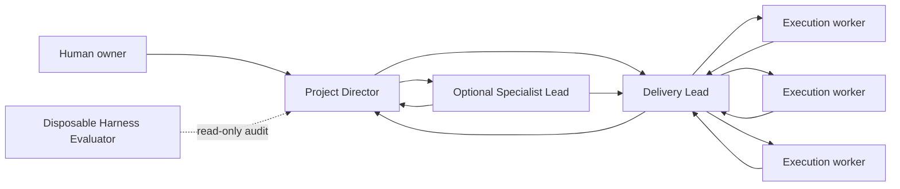

# Agentic Project Harness

[](https://github.com/FabienGreard/agentic-project-harness/stargazers)
[](LICENSE)
[](CONTRIBUTING.md)

A reusable, evidence-driven multi-agent project orchestration template for software, games, research, operations, and other complex work.

This repository contains the coordination system—not an application. Use it as a GitHub template, define your project, register the permanent roles your environment supports, and let execution workers operate from bounded, reviewable assignments.

## Why “harness”?

An agent prompt describes one task. A harness defines how a whole project keeps moving safely over time:

- who owns direction, delivery, specialist judgment, and execution;
- when work is ready to start;
- how new requests affect active work;
- how independent work runs in parallel without file or system conflicts;
- how results return, integrate, and receive human review;
- when long-running roles pause instead of polling;
- how the orchestration system itself is evaluated.

## Core model



- **Project Director:** owns intended outcomes, priority, scope, readiness, decisions, publication, and human-review gates.
- **Delivery Lead:** owns execution planning, worker dispatch, exclusive ownership, integration, verification, and run-to-idle delivery.
- **Specialist Lead:** optionally owns a bounded expert domain such as design, legal, finance, safety, data, security, or art. It defines and reviews; Delivery remains the single dispatch center.
- **Execution workers:** implement only their assigned scopes and return evidence to Delivery.
- **Harness Evaluator:** a disposable, independent, read-only worker that grades orchestration behavior and never fixes what it evaluates.

## Start a project

### Quick installer

Download, inspect, and run the installer:

```sh
curl -fsSLo /tmp/agentic-project-harness-install.sh \
  https://raw.githubusercontent.com/FabienGreard/agentic-project-harness/main/install.sh
less /tmp/agentic-project-harness-install.sh
bash /tmp/agentic-project-harness-install.sh
```

For an agent or non-interactive shell:

```sh
bash /tmp/agentic-project-harness-install.sh \
  --project-name "My Project" \
  --target ./my-project \
  --director-reasoning high \
  --delivery-reasoning high \
  --worker-reasoning medium \
  --evaluator-reasoning high \
  --yes
```

The installer creates a clean Codex project, lets you choose the reasoning level for each agent role, generates native project-scoped custom agent files under `.codex/agents/`, runs the static harness checks, and initializes Git without committing. It refuses to overwrite a non-empty target.

See [docs/installation.md](docs/installation.md) for all options and the direct one-line form.

### GitHub template

1. Click **Use this template** on GitHub and create a new repository.
2. Follow [TEMPLATE_CHECKLIST.md](TEMPLATE_CHECKLIST.md).
3. Replace the starter state in `docs/overview.md`, `docs/direction.md`, `docs/backlog.md`, and `docs/project-state.json`.
4. Choose only the permanent roles your project needs. Start with Director and Delivery; add Specialist Leads when a recurring expert acceptance boundary is real.
5. Register task/thread identifiers locally in `docs/thread-registry.md` without committing secrets.
6. Promote work to `Ready` only after the readiness contract is complete.
7. Run `python3 tools/harness_eval.py` before the first implementation handoff.

## Repository layout

```text
.
├── AGENTS.md                         # Top-level operating rules
├── install.sh                        # Interactive and agent-friendly bootstrapper
├── BOOTSTRAP_PROMPT.md               # First prompt to give Codex
├── .codex/
│   ├── config.toml                   # Project-scoped concurrency defaults
│   └── agents/                       # Per-role Codex reasoning configuration
├── docs/
│   ├── overview.md                   # Current project truth and next action
│   ├── direction.md                  # Approved outcomes and constraints
│   ├── backlog.md                    # Human-readable work index
│   ├── active-work.md                # Ownership and integration state
│   ├── project-state.json            # Machine-readable state index
│   ├── workflow.md                   # Readiness, handoff, review, idle rules
│   ├── roles/                        # Permanent and disposable role contracts
│   ├── templates/                    # Decision, PRD, ticket, report templates
│   ├── schemas/                      # Machine-readable contracts
│   └── evals/harness/                # Static and scenario evaluation suite
├── examples/
│   ├── game-development/             # Optional game-domain adaptation
│   └── business-operations/          # Optional business-domain adaptation
├── tools/harness_eval.py             # Dependency-free static verifier
├── tests/                             # Local and standalone-download installer smoke checks
└── .github/                           # Issues, PRs, community health
```

## The baton rule

Every orchestration run ends in one explicit state:

- a named owner has the next meaningful action and return trigger;
- a result or review is pending from a named owner;
- a future action is waiting on a recorded trigger;
- progress is blocked on a precise decision that has been escalated once;
- no meaningful action remains and the smallest wake condition is recorded.

No role should poll work it has delegated. A new request does not automatically cancel active work; classify it as superseding, parallel, queued, or informational first.

## Worker-first, not worker-only

Substantial independent work should normally be dispatched to workers so Delivery remains available for coordination, review, and integration. Direct Lead implementation is still appropriate for small, tightly coupled, architecture-sensitive, integration, verification, or narrow revision work. The harness rewards useful parallelism and rejects artificial parallelism across shared files or unstable contracts.

## Harness evaluation

The included evaluation suite has four modes:

- deterministic repository checks;
- one-pass scenario smoke tests;
- repeated scenario release comparisons;
- independent audits of real task traces.

The evaluator checks hard failures first—such as non-ready execution, overlapping ownership, lost work, invented intent, skipped specialist/human gates, missing batons, contradictory state, and unproven completion—then scores scope, handoffs, safety, parallelism, advancement, and interruption efficiency.

See [docs/evals/harness/README.md](docs/evals/harness/README.md).

## Domain examples

- [Game development](examples/game-development/README.md): Project Director, Production Lead, optional Art/Design Lead, engineering and asset workers, playable-slice reviews.
- [Business operations](examples/business-operations/README.md): Program Director, Operations Lead, optional Finance/Legal/Domain Lead, analysis and process workers, approval checkpoints.

Examples are overlays, not separate frameworks. Keep the authority and handoff model; rename roles and gates to match the domain.

## Contributing

Issues, discussions, and pull requests are welcome. Good contributions add reproducible failure cases, improve clarity without weakening gates, or make the harness easier to adopt across domains.

Read [CONTRIBUTING.md](CONTRIBUTING.md). If this starter is useful, star the repository so other teams can find it.

## License

[MIT](LICENSE) © 2026 Fabien Gréard.
