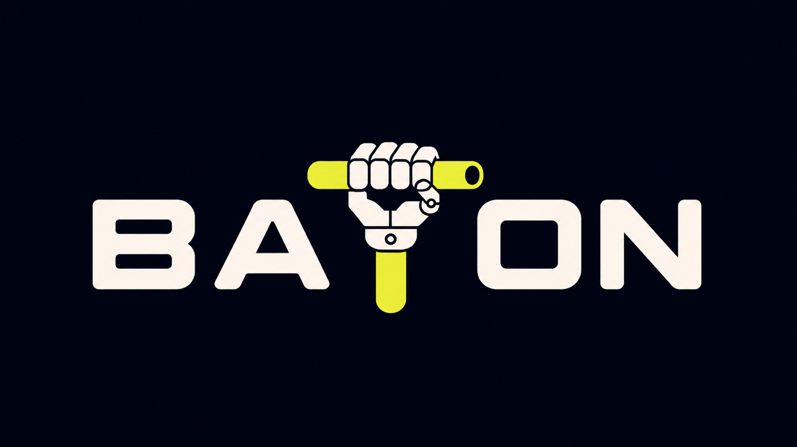

<p align="center">
  
</p>

# Baton

Baton is a repository-local control plane for teams of AI agents. It defines who decides, who executes, what is ready, and what evidence is required.

It installs an isolated `.baton/` layer without taking ownership of the repository. Canonical State coordinates work; Markdown Records hold durable context; the live Repository proves implementation.

`.baton/AGENTS.md` is the single entry. It loads every rule, then routes the agent to current state, assigned work, its role, and only the skills or memory needed.

## Quick start

From the root of the repository Baton should manage:

```sh
cd /path/to/your-project
curl -fsSL https://github.com/FabienGreard/baton/releases/latest/download/install.sh | bash
```

Next, open the repository in your LLM coding agent and invoke:

```text
$boot
```

It completes onboarding or adoption and starts the permanent team.

Installer footprint:

```text
your-project/
├── .baton/              # added
├── AGENTS.md            # created or Baton block updated
├── .agents/skills/      # Baton skill links added when free
└── .codex/config.toml   # created if absent; otherwise preserved
```

It preserves existing Project files and never stages or commits them.

This source checkout currently contains an unpublished candidate. Install only from an approved stable release asset, never a branch or source archive.

## Documentation

| Guide | Use it for |
| --- | --- |
| [Getting started](docs/getting-started.md) | Install Baton, invoke `$boot`, and start work. |
| [Installation](docs/installation.md) | Installation, adoption, updates, and recovery. |
| [Customization](docs/customization.md) | Team, protocols, Memory, and host integration. |
| [Architecture](docs/architecture.md) | Distribution, State, Records, skills, and transactions. |
| [Releasing](docs/releasing.md) | Verify, approve, and publish a stable release. |
| [CLI reference](docs/cli.md) | Exact commands for automation and diagnostics. |

Historical changes are in [CHANGELOG.md](CHANGELOG.md). Baton is MIT licensed; adapted material is listed in [THIRD_PARTY_NOTICES.md](THIRD_PARTY_NOTICES.md).
