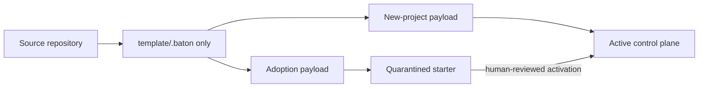
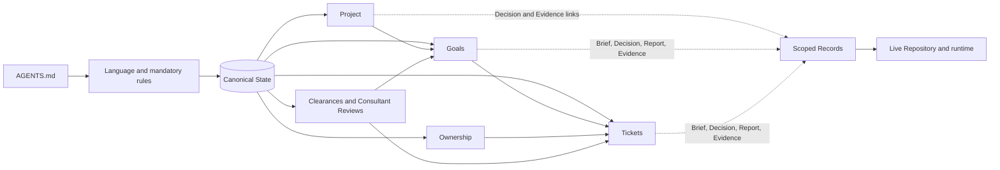

# Architecture

Baton separates its source distribution from installed Repository control planes.

## Distribution boundary



```text
source repository
├── .baton/             source project's live control plane; never shipped
├── template/.baton/    only consumer source
├── docs/               public guides
├── scripts/            installer, evaluator, release builder
└── tests/              source verification

installed repository
├── .baton/             entry, rules, State, Records, Memory, roles, skills, views
├── AGENTS.md            one marked Baton block
└── host adapter paths   provider config and individual skill links
```

The builder rejects any consumer source elsewhere under `template/`.

## Payload projection

| Source class | New project | Mature adoption |
| --- | --- | --- |
| Shared runtime | `.baton/<path>` | `.baton/<path>` |
| Starter state and guidance | Active `.baton/<path>` | `.baton/migration/starter/<path>` |
| Adoption guide | Excluded | `.baton/migration/<path>` |

`migration/` exists only for adoption and is never authoritative. Later `$roster` conflicts produce checksummed proposals instead of changing Repository files.

The manifest records every path, destination, type, and SHA-256. Archives use stable ordering and safe paths. Duplicate, unsigned, unsafe, or non-`.baton/` entries fail validation.

## Runtime model



```text
.baton/
├── AGENTS.md                  single entry and load order
├── rules/                     mandatory rules, always read
├── state/                     approved direction and work coordination
├── records/
│   ├── PROJECT/               Project Decisions and Evidence
│   ├── <GOAL-ID>/             Goal Brief, Decisions, Report, Reviews, Evidence
│   └── <TICKET-ID>/           Ticket Brief, Decisions, Report, Reviews, Evidence
├── memory/                    provisional context and confirmed memory
├── roles/ and skills/         loaded only when assigned or invoked
└── views/                     generated, non-authoritative output
```

State contains project, goals, tickets, ownership, reviews, and team. The live repository and runtime prove implementation.

The Project record defines default Readiness and Clearance Protocols. Goals and Tickets select their own Clearance Protocol; Tickets also select a Readiness Protocol. State changes move the work, ownership, evidence, and next action together.

## Skills and adapters

Seven skills are Baton's public management surface: `$boot`, `$control`, `$roster`, `$terminal`, `$upgrade`, `$doctor`, and `$scrap`. Each uses one matching local CLI family. The CLI is only for exact commands, JSON, and automation. Memory stays internal.

A provider adapter exposes the skills, role configuration, and task surface. Baton's authority, State, and lifecycle stay provider-neutral. `$boot` creates the permanent team only when it can list, create, identify, title, message, and clean up tasks safely. Otherwise it returns a copy-ready action.

## Memory and transactions

`.baton/memory/memory.json` holds provisional context and confirmed company memory. `history.jsonl` keeps a value-minimized history. Approved direction lives in `state/project.json`; Memory does not replace it.

`$boot` validates presets against `.baton/team-presets.json` and keeps onboarding in the original task. It does not repeat a declined suggestion without new evidence.

All Baton writes share one external Repository lock. Baton prepares the change outside the Repository, backs up touched paths, applies and validates the plan, then writes a Report. On failure it restores the backup or reports the limitation.

Cleanup is a separate human decision. `--yes`, activation, update success, or an agent recommendation never authorizes deletion.

## Release assets

The deterministic builder emits exactly:

```text
install.sh
baton-new-project.tar.gz
baton-adoption.tar.gz
baton-manifest.json
SHA256SUMS
```

The installer is a temporary stable-release bootstrapper, not an installed Repository file. See [Releasing](releasing.md).
