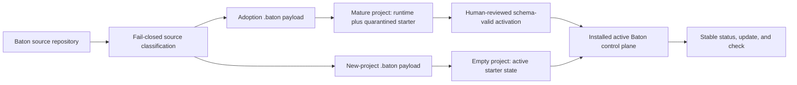

# Baton distribution architecture

Baton v0.6.0 separates product development from installed project control planes. This repository is a normal source repository; a consumer receives only a release-built `.baton/` payload plus three narrow, collision-preserving root integrations.

## System boundary



The source and consumer trees are deliberately different:

```text
source repository
├── .baton/                         Baton's own live, source-only control plane
├── packages/consumer/.baton/       only source for consumer .baton content
├── docs/                            public product documentation
├── tools/                           source evaluator and release builder
├── tests/                           source and distribution verification
├── install.sh                       separate stable release asset source
├── VERSION                          Baton source candidate version
└── release/source-classification.json

installed consumer
├── .baton/                          runtime, metadata, state, rules, roles, skills
├── AGENTS.md                        project content plus one Baton-managed block
├── .codex/config.toml               created only when absent; otherwise preserved
└── .agents/skills/<name>            individual links created only when free
```

The installed consumer has no Baton root `install.sh`, `tools/`, `tests/`, evaluator, source docs, examples, changelog, license/community files, release machinery, or root version file.

## Source classification

`release/source-classification.json` is a tracked, exact inventory of every Git-tracked source path. The release builder compares it with `git ls-files` and rejects missing, stale, unsupported, or policy-inconsistent records.

| Class | Meaning | New-project payload | Adoption payload |
| --- | --- | --- | --- |
| `source-only` | Product source, this repository's own `.baton/`, docs, tests, tooling, legal/community and release files | Excluded | Excluded |
| `shared` | Consumer runtime needed in both modes | `.baton/<path>` | `.baton/<path>` |
| `template-only` | Starter project direction, records, dashboard inputs, decisions, PRDs, tickets, and report scaffolding | Active `.baton/<path>` | Quarantined `.baton/integration/starter/<path>` |
| `adoption-runtime` | Guidance needed only while integrating a mature project | Excluded | `.baton/integration/<path>` |

Classification is inferred from the approved source layout and then committed as an explicit contract. It is not an allow-everything glob. Consumer payload construction accepts source only from `packages/consumer/`, strips that prefix, and rejects any archive entry outside `.baton/`.

The source repository's root `.baton/` can therefore never enter a payload: it is outside `packages/consumer/` and classified source-only.

## Deterministic dual payloads

The release builder creates:

- `baton-new-project.tar.gz`;
- `baton-adoption.tar.gz`;
- `baton-manifest.json`;
- `install.sh`; and
- `SHA256SUMS`.

`baton-manifest.json` records the stable version/tag, official repository, full source commit, state schema version, supported upgrade origins, source-classification digest, and an exact sorted file record for each payload. Every file record includes destination path, source path, class, entry kind, and SHA-256 digest.

Archives are deterministic: sorted entries, normalized ownership, zero timestamps, constrained modes, safe relative paths, and safe relative symlinks. Validation rejects duplicate paths, hard links, devices, FIFOs, unsafe symlink traversal, unsigned/missing entries, wrong checksums, and forbidden root files.

## One stable lifecycle

The release `install.sh` is a temporary stable-URL bootstrap asset, not an installed project file. It downloads all five assets from the official latest stable release, verifies the entire bundle contract, selects one payload, extracts it to temporary storage, and invokes the verified lifecycle engine. It is never copied into the consumer root or `.baton/` tree.

After installation, `.baton/bin/baton` is the only public maintenance command:

```text
status   inspect metadata, provenance, integrity, integration, and cleanup state
update   fetch and invoke the same official stable lifecycle
check    validate canonical Baton state and team records
```

The one-time `.baton/bin/baton _activate --from PATH` path is documented only for reviewed mature adoption. Other deterministic mutation plumbing remains internal to Baton roles and skills and is not part of the public CLI.

Only stable release manifests are valid. A manifest pins its source to a full commit and each supported origin to a full commit; schema-v2 origins additionally require their manifest SHA-256. Updates never consume a moving branch, draft, prerelease, local development build, mutable tag assumption, or unverified fork.

## Metadata and version separation

`.baton/metadata.json` schema v3 is the lifecycle record. Important fields include:

- `batonVersion`: installed runtime version from the verified stable manifest;
- `projectVersion`: optional, independent project information, initialized to `null`;
- `stateSchemaVersion`: canonical state contract version;
- `installationStatus`: `Installed`, `Needs Integration`, or source/legacy states where applicable;
- `source`: repository, stable channel, tag, full commit, and manifest digest;
- `managedFiles`: ownership class and baseline checksum per managed path;
- `managedBlocks`: checksum for the Baton section inside shared files such as `AGENTS.md`;
- `projectOwnedFiles`: paths Baton must preserve across updates;
- `legacyCleanupCandidates`, `legacyMigration`, and `pendingIntegration`; and
- external transaction identity.

Baton never derives `batonVersion` from a project's `VERSION`, package metadata, Git tags, or release files. Those surrounding files remain optional and project-owned.

## New project versus mature adoption

### New project

An empty target can safely receive starter project state. Baton configures project name, preset, reasoning, selected Consultants, canonical records, role configs, and dashboard, then records `Installed`. It initializes Git on `main` without committing.

### Mature adoption

A non-empty target already has identity and history. Baton installs shared runtime but relocates every template-only path into `.baton/integration/starter/`, generates an integration prompt, and records `Needs Integration`.

The quarantine prevents generic starter direction, goals, tickets, ownership, reviews, or team records from becoming authority. A mature proposal must be non-template state built from live repository facts and contain all six schema-valid canonical records. Human-reviewed `.baton/bin/baton _activate --from PATH` validates the proposal and current baselines before writing active state.

Activation is atomic and collision-intolerant. It will not replace a pre-existing active target, modified managed config, unsafe path, or mismatched team contract. It changes the Baton block from integration guidance to the active agent map only after the transaction succeeds.

## Narrow root integration

### Managed `AGENTS.md` block

Baton owns one delimited block and preserves all surrounding project content. Ambiguous or duplicated markers fail closed.

### Codex config

If `.codex/config.toml` is absent, Baton creates the base permission and agent registration contract. If it exists, it stays project-owned; Baton writes the desired config to `.baton/integration/codex-config.toml` and records a manual semantic-merge action.

### Skill discovery

Each supported `.agents/skills/<name>` path is considered independently. Baton adds a relative link to `.baton/skills/<name>` only when the path is free. A file, directory, or different symlink is preserved as a collision. There is no root `.codex/skills` link and no duplicated skill tree.

No other consumer root path is allowed by the payload or lifecycle contract.

## Update planning

A stable update compares three states:

1. the installed baseline identified by `.baton/metadata.json` and the target manifest's immutable supported-origin record;
2. the current local path and checksum; and
3. the target stable payload path and checksum.

An unchanged managed path may be replaced by its new stable form. A new Baton path may be added only if no collision exists. Modified managed/generated paths, missing baselines, unsupported provenance, downgrade attempts, or colliding additions block the update. Project-owned paths remain untouched.

Paths retired from Baton's managed runtime become cleanup candidates only when Baton has a valid managed baseline and the current file still matches it; they are not deleted automatically. Legacy schemas without per-file baselines never produce guessed project-path candidates. Baton instead records the available legacy metadata, immutable source evidence, and a manual comparison requirement while preserving every non-metadata path. When a historical remote installer did not record its installed commit, Baton keeps that value absent and labels any known stable tag/commit as a version anchor rather than misrepresenting it as installation provenance.

## Transactions and cleanup

Supported installation, activation, update, state, and team mutations share one external per-project lock. Each lifecycle mutation prepares content away from the project, backs up every touched destination outside the worktree, applies a bounded plan, validates the result, and writes a final report. Failure triggers restoration from the same transaction.

Cleanup is a separate human boundary. The report and generated prompt retain:

- exact added/replaced/preserved/colliding or retired paths;
- baseline, current, and target checksums;
- legacy cleanup candidates;
- legacy per-file baseline status or an explicit statement that baselines were unavailable;
- transaction report and backup locations;
- the stable release URL;
- a direct immutable comparison such as `https://github.com/FabienGreard/baton/compare/<origin-full-sha>...<target-full-sha>`; and
- direct target sources such as `https://github.com/FabienGreard/baton/blob/<target-full-sha>/packages/consumer/.baton/<path>`.

An LLM may analyze and propose cleanup from that evidence. Humans retain authority over deletion, external commitments, security/compliance decisions, and publication. `--yes`, activation, update success, or a generated prompt never transfers that authority.

## Validation layers

The source repository has two different validation boundaries:

- **Source evaluation** inspects product source, root `.baton/` state, release classification, tests, docs, and release tooling. It is never consumer payload content.
- **Consumer validation** inspects Baton-owned `.baton/` paths and explicit Git-visible integration paths. It does not recursively scan ignored vendor trees or claim ownership of the surrounding repository.

Release acceptance combines classification validation, exact dual-manifest validation, empty-project and mature-adoption smokes, legacy migration, collision/rollback/lock/path-safety coverage, Python compatibility, two-axis review, and independent disposable Internal Audit.

See [Release policy](release-policy.md) and [Releasing](releasing.md) for the stable publication boundary.
